

# DNX ONE - AWS Well-Architected Foundation

This Document presents all details on Carguero AWS Structure.

All configurations were applied using Infrastructure as Code. Just the initial configurations were applied using AWS CloudFormation service. And the main configurations were applied by Terraform using DNX ONE modules.

The image below summarises the whole AWS Architecture.

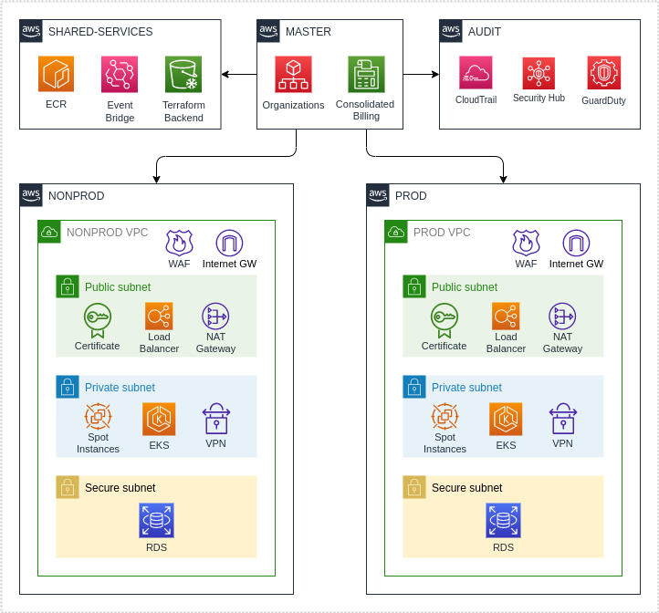

## Table of Contents

1. [Account Structure](#account-structure)
1. [Networking](#networking)
1. [DNS](#dns)
1. [VPN](#vpn)
1. [Security](#security)
1. [ECR](#ecr)
1. [Kubernetes](#kubernetes)
1. [Rancher](#rancher) 
1. [ArgoCD](#argocd) 
1. [Infrastructure Pipeline](#infrastructure-pipeline)
1. [Application Pipeline](#application-pipeline)
1. [Storage](#storage)
1. [Logs, Alerts and Audit](#logs-alerts-and-audit)
1. [Billing](#billing)
1. [FAQ](#faq)

## Account Structure

The account setup was applied manually via AWS Console using the AWS Organizations service.

| AWS Account         | Number          | Description                                                                                                                                                           |
| ------------------- | --------------- | --------------------------------------------------------------------------------------------------------------------------------------------------------------------- |
| MASTER              | 498464264896    | Root Organization account containing: Consolidate Billing and AWS Organization.                                                                                       |
| AUDIT               | 171990700439    | The audit account has read-only access and is responsible for storing logs to be used in a possible internal or external audit.                                       |
| SHARED-SERVICES     | 815538987058    | This account has any shared services to be consumed by the AWS structure: Terraform Backend, IAM Roles, ECR Repositories, S3 Buckets, etc.                            |
| NONPROD             | 015312168739    | All application workloads for non-production should run into this account. AWS Networking, EKS Clusters, ALBs and Route53 Hosted Zones are hosted into this account.  |
| PROD                | 350882285343    | All application workloads for production should run into this account. AWS Networking, EKS Clusters, ALBs and Route53 Hosted Zones are hosted into this account.      |

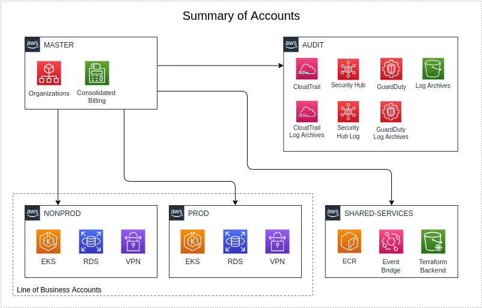

## Networking

The VPCs of the productive and non-productive environments are separate and each one has three layers of subnets, as shown in the following picture. The shared-services account does not have configured VPC resources once does not have any network-dependent services. All configurations were applied using Infrastructure as Code by Terraform.

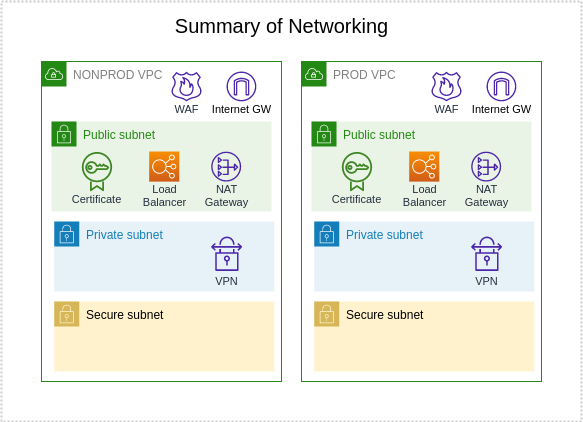

The Internet egress is provisioned from the AWS NAT Gateway service which allows communication between the Internet and resources that are on the private subnet.

For the non-productive environment, 01 NAT Gateway was made available from 01 Availability Zone (AZ). And for the productive environment, 03 NAT Gateways were made available in 03 different AZs to have redundancy to failures.

NONPROD and PROD accounts are allowed to have workloads, therefore, the following VPCs (Virtual Private Cloud) have been created:

| AWS Account        | Cidr            | Description          |
| ------------------ | --------------- | -------------------- |
| NONPROD            | 10.57.0.0/16    | Number of NATs: 1    |
| PROD               | 10.47.0.0/16    | Number of NATs: 3    |

And in the next table are listed the outgoing public IP addresses that are allocated in each environment:

| AWS Account        | Public IP       |
| ------------------ | --------------- |
| NONPROD            | 44.194.83.20    |
| PROD               | 54.232.55.225   54.232.135.54   54.233.0.124 |

### Subnets

Inside every VPC (Virtual Private Cloud) there are subnets to manage network traffic within the VPC leveraging robust security layers for your environments.

| Subnets Layer      | Description                                      |
| ------------------ | ------------------------------------------------ |
| Public DMZ         | This layer has public access, typically all workloads here will have a public access endpoint. AWS LoadBalancers and AWS NATs (Network Address Translation) will be deployed into this layer. |
| Private            | Private subnets are not public access, only public and secure subnets can reach this layer. All outbound requests are routed to NATs (Network Address Translation) deployed on the public layer. Application workloads should be deployed into this layer. |
| Secure             | Secure subnets are not public access, they are only accessible from Private subnets and are ideal for data storage services. |

| AWS Account        | Subnet Type    | Cidr              | Availabillity Zone    |
| ------------------ | -------------- | ----------------- | --------------------- |
| NONPROD            | Public-A       | 10.57.0.0/20      | us-east-1a            |
| NONPROD            | Public-B       | 10.57.16.0/20     | us-east-1b            |
| NONPROD            | Public-C       | 10.57.32.0/20     | us-east-1c            |
| NONPROD            | Private-A      | 10.57.80.0/20     | us-east-1a            |
| NONPROD            | Private-B      | 10.57.96.0/20     | us-east-1b            |
| NONPROD            | Private-C      | 10.57.112.0/20    | us-east-1c            |
| NONPROD            | Secure-A       | 10.57.160.0/20    | us-east-1a            |
| NONPROD            | Secure-B       | 10.57.176.0/20    | us-east-1b            |
| NONPROD            | Secure-C       | 10.57.192.0/20    | us-east-1c            |
| PROD               | Public-A       | 10.47.0.0/20      | sa-east-1b            |
| PROD               | Public-B       | 10.47.16.0/20     | sa-east-1b            |
| PROD               | Public-C       | 10.47.32.0/20     | sa-east-1c            |
| PROD               | Private-A      | 10.47.80.0/20     | sa-east-1a            |
| PROD               | Private-B      | 10.47.96.0/20     | sa-east-1b            |
| PROD               | Private-C      | 10.47.112.0/20    | sa-east-1c            |
| PROD               | Secure-A       | 10.47.160.0/20    | sa-east-1a            |
| PROD               | Secure-B       | 10.47.176.0/20    | sa-east-1b            |
| PROD               | Secure-C       | 10.47.192.0/20    | sa-east-1c            |

### NACLS (Network Access Control List)

Intra subnet communications are handled by router rules and NACLs (Networking Access Control list). This is the foundations for security in depth and strong policies to deny unauthorized traffic into subnets.

By default, layer hopping is blocked between public subnets and secure subnets. It is necessary to follow the flow through each layer.

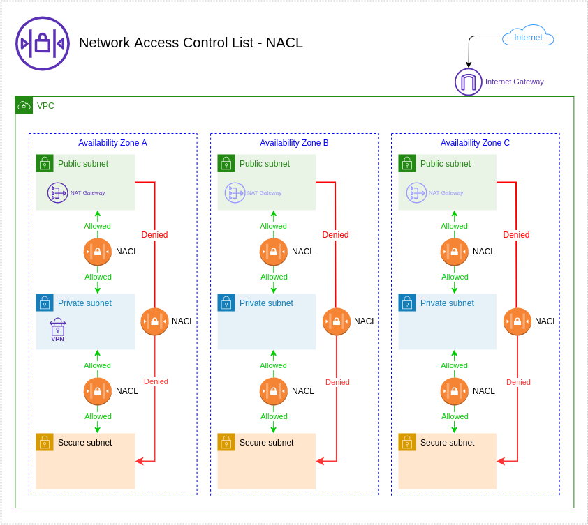

## DNS

The AWS Foundation stack has multiple AWS Accounts but just NONPROD and PROD environments have Route53 Hosted Zones, each one have valid DNS (Domain Name Service) entries and a valid SSL certificated managed by ACM (AWS Cetificate Manager).

All configurations were applied using Infrastructure as Code by Terraform and the related Git project can be found at:
[infra-carguero-v3 / platform]

| Account            | Subdomain                                                                                                            |
| ------------------ | -------------------------------------------------------------------------------------------------------------------- |
| PROD               | prod.cloud.carguero.com.br                                                                                           |
| NONPROD            | dev.cloud.carguero.com.br   sandbox.cloud.carguero.com.br   staging.cloud.carguero.com.br   hml.cloud.carguero.com.br |

All application-related names should be created using the appropriate account hosted zone:

- prod.cloud.carguero.com.br   
- dev.cloud.carguero.com.br    
- sandbox.cloud.carguero.com.br
- staging.cloud.carguero.com.br
- hml.cloud.carguero.com.br    

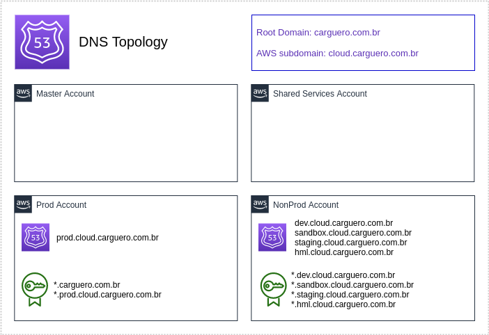

## VPN

The DNX ONE - AWS Well-Architected Foundation requires a VPN (Virtual Private Network) connection to allow direct access to all network layers. When the connection is established, the VPN (Virtual Private Network) server will allow access to all VPCs (Virtual Private Cloud) in the environment.

All configurations were applied using Infrastructure as Code by Terraform and the related Git project can be found at:
[infra-carguero-v3 / platform]

The connection with the VPN (Virtual Private Network) server requires individual keys and MFA (Multi Factor Authentication). Check the VPN (Virtual Private Network) topology below for more details:

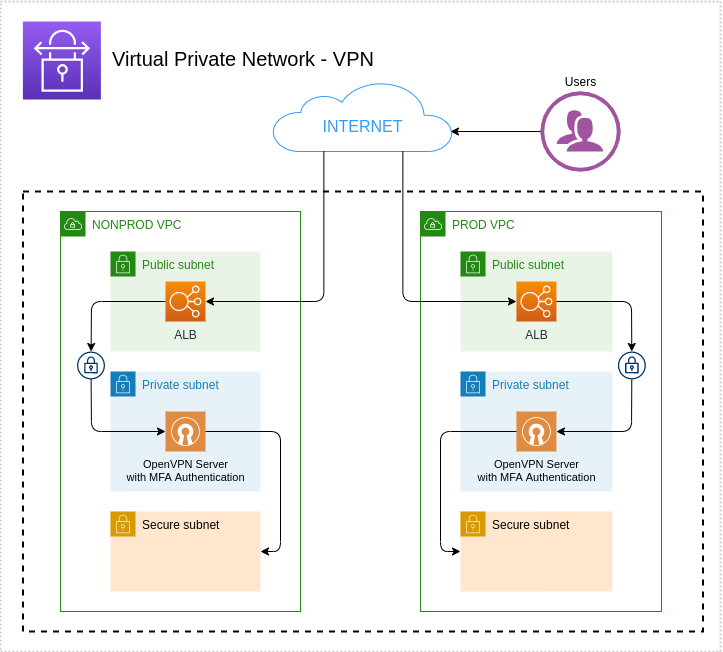

The VPN (Virtual Private Network) solution is open-source (OpenVPN) you can find more details consulting also their documentation: https://openvpn.net/community-resources/.

## Security

The DNX ONE - AWS Well-Architected Foundation applies a set of IAM (Identity and Access Management) resources across the AWS accounts to apply the concept of least privilege and provide exactly the needed policy at the time for users and systems.

All configurations were applied using infrastructure-as-code using Terraform in the identity stack in this repo.

In this platform, most of the regular access to AWS cloud will be using SSO (Single Sign On) using the organisation's GSuite. 

The DNX Foundation comes with 9 roles already available per environment, they are:

| IAM Role                                      | Description                                                                                                                              | ARN |
| --------------------------------------------- | ---------------------------------------------------------------------------------------------------------------------------------------- | --- |
| AdministratorAccess                           | Grants all actions for all AWS services and for all resources in the account.                                                            | `arn:aws:iam::<aws_account_id>:role/AdministratorAccess` |
| ViewOnlyAccess                                | Grants permissions to list AWS resources and basic metadata in the account across all services.                                          | `arn:aws:iam::<aws_account_id>:role/ViewOnlyAccess` |
| PowerUserAccess                               | Grants permissions to performs application development tasks and can create and configure resources and services that support AWS aware application development. | `arn:aws:iam::<aws_account_id>:role/PowerUserAccess` |
| SecurityAudit                                 | Grants permissions to monitor accounts for compliance with security requeriments.                                                        | `arn:aws:iam::<aws_account_id>:role/SecurityAudit` |
| DataScientist                                 | Grants permissions to create, manage, run queries and perform data analytics.                                                            | `arn:aws:iam::<aws_account_id>:role/DataScientist` |
| DatabaseAdministrator                         | Grants permissions to create, configure, and maintain databases..                                                                        | `arn:aws:iam::<aws_account_id>:role/DatabaseAdministrator` |
| NetworkAdministrator                          | Grants permissions to create and maintain network resources.                                                                             | `arn:aws:iam::<aws_account_id>:role/NetworkAdministrator` |
| SupportUser                                   | Grants permissions to contact AWS Support, creates support cases, and views the status of existing cases.                                | `arn:aws:iam::<aws_account_id>:role/SupportUser` |
| SystemAdministrator                           | Grants permissions to create and maintain resources across a large variety of AWS services, including AWS CloudTrail, Amazon CloudWatch. | `arn:aws:iam::<aws_account_id>:role/SystemAdministrator` |

These roles are based on the policies maintained by AWS described in this page: https://docs.aws.amazon.com/IAM/latest/UserGuide/access_policies_job-functions.html

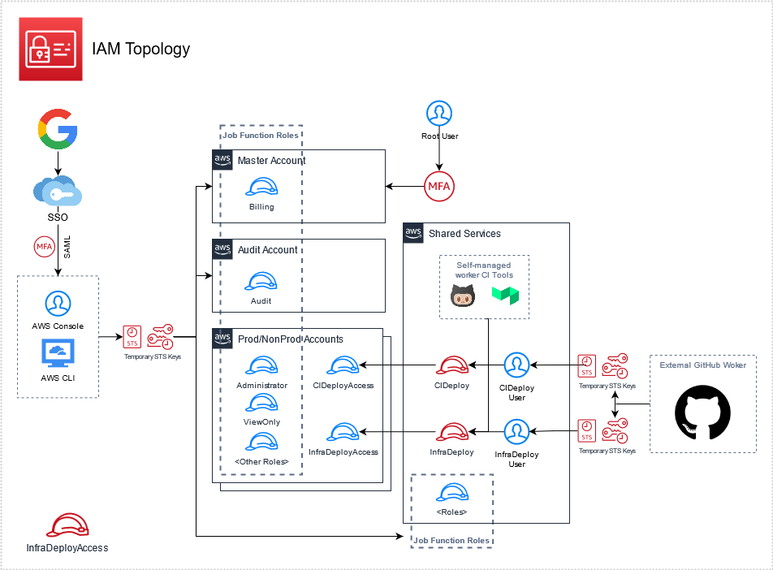

## ECR

The ECR (Elastic Container Registry) repository is located in the AWS SHARED-SERVICES Account and the High-level integration with NONPROD and PROD accounts is shown below.

All configurations were applied using Infrastructure as Code by Terraform and the related Git project can be found at:
[infra-carguero-v3 / platform]

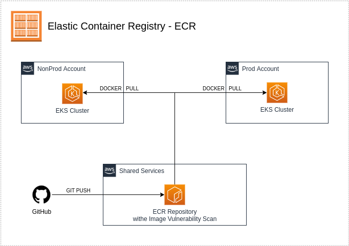

## Kubernetes

The provided container infrastructure uses Kubernetes as base (EKS version 1.21), in which the cluster nodes are arranged in different availability zones, with autoscale implemented. Access to cluster applications is via the AWS ALB Ingress Controller, in which a load balancer ALB-type is deployed on the public subnet, which provides access to services on the private subnet, where the cluster nodes were deployed. Access via load balancer is secured by certificate, which is generated with the ACM service for each account. A Node Group with Spot instances are available initially, but others can be added later.

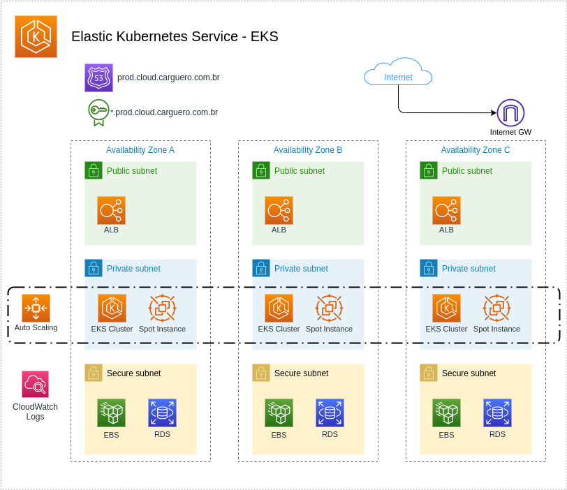

## Rancher

Rancher tool is used to manage the Cluster which access all the resources. In addition it can view metrics and logs of the deployed containers. 

| AWS Account        | Service Address                               |
| ------------------ | --------------------------------------------- |
| NONPROD            | https://rancher.dev.cloud.carguero.com.br/    |
| PROD               | https://rancher.prod.cloud.carguero.com.br/   |

## ArgoCD

Argo CD tool uses the GitOps approach and performs the synchronization of an application's manifest, after its build on Github Actions. These synchronization can be either manual or automatic.

| AWS Account        | Service Address                               |
| ------------------ | --------------------------------------------- |
| NONPROD            | https://argocd.dev.cloud.carguero.com.br/     |
| PROD               | https://argocd.prod.cloud.carguero.com.br/    |

## Infrastructure-Pipeline

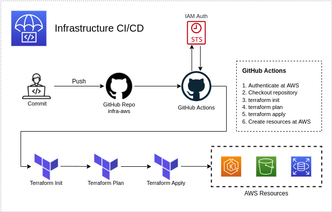

## Application-Pipeline

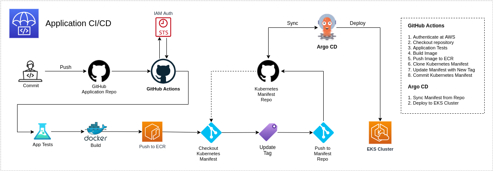

## Storage

The storage services used in your AWS environment are basically S3 (Simple Storage Service) and EFS (Elastic File System), where S3 (simple storage service) is object-based-storage used for static files and EFS is block-based-storage where one EFS (Elastic File System) volume is attached to this state for any stateful application.

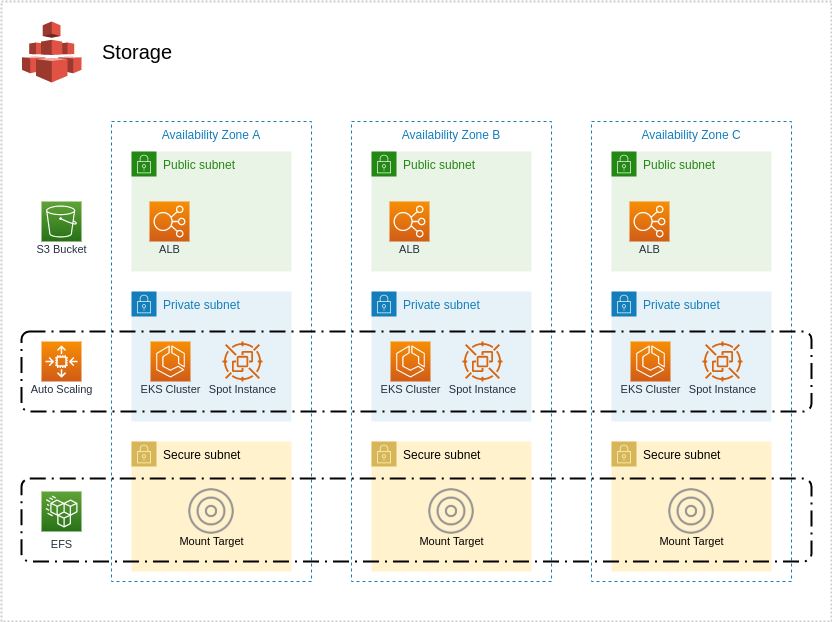

## Cost Optimisation

To reduce the costs of NONPROD environments is possible to switch off environments temporarily, for example after working hours and switch them on again during working hours.

A standard configuration is to switch the resources off at 8 PM and restart them all at 7 AM in the next day, so during the period when no one is working cost will be reduced.

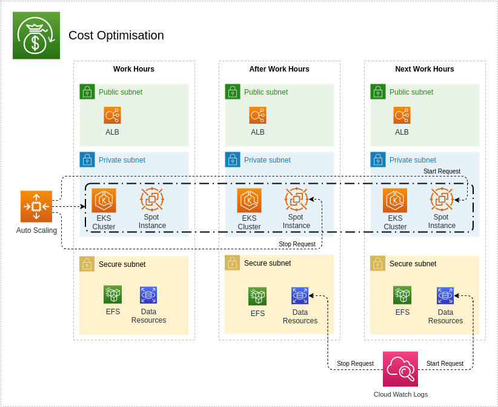

## Backup

The RDS (Relational Database Service) database and EFS are backed up automatically according to the backup plan for production environment. Others resources can also be assigned to a backup plan using tags.

There are no policies implemented for restoring process it can be performed through AWS console.

You can restore the RDS (Relational Database Service) database to any point in time following the retention period:

| Environment  | Retention Period |
| ------------ | -----------------|
| NONPROD      |  X days          |
| PROD         |  X days          |

Restore procedure AWS User Guide:

https://docs.aws.amazon.com/AmazonRDS/latest/UserGuide/USER_RestoreFromSnapshot.html.

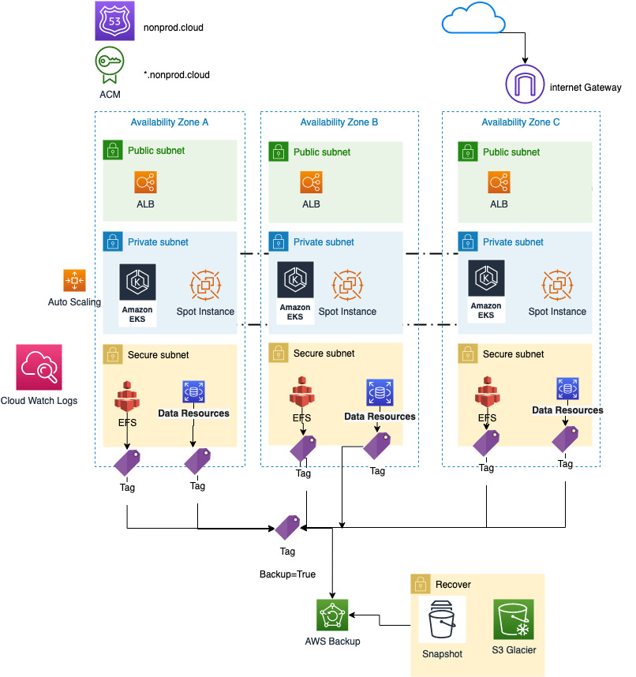

## logs-alerts-and-audit

You can find your logs centralized on CloudWatch. This AWS service allows you to centralize the logs for all your systems, applications and services.

You can view, search for specific error codes or patterns, filter them based on specific fields or safely archive them for future analysis. 

CloudWatch allows you to view all of your logs regardless of their source, as a single, consistent stream of events ordered by time, and you can query and sort them based on other dimensions, group them by specific fields, create custom calculations with a powerful query language.

CloudWatch allows alarms to be created to monitor your applications, services and resources. These alarms can be configured to send alert messages using the SNS (Simple Notification Service).

CloudWatch can be used to create customised Dashboards allowing a quick view.

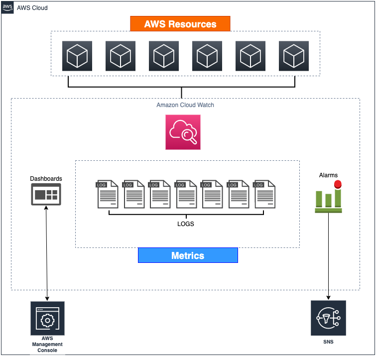

More details: https://docs.aws.amazon.com/AmazonCloudWatch/latest/logs/WhatIsCloudWatchLogs.html.

### Auditing

Your AWS events are reported to CloudTrail and will allow you to check events for up to 90 days directly from the AWS console.

You can choose to export your events to an S3 (Simple Storage Service) bucket if you want to integrate them with another solution or send your event logs to internal and external audit processes.

The DNX Foundation creates a special account called "Audit" to store these events. This account has a S3 (Simple Storage Service) bucket with "Ready Only" access ensuring that all events are stored without changes.

More details: https://docs.aws.amazon.com/awscloudtrail/latest/userguide/cloudtrail-getting-started.html.

### Billing

This module is primarily used for resource optimization. It aims for cost reduction without affecting the performance of the environment.
The billing module can be found at infra-carguero-root and consists of the following resources:

- IAM (Identity and Access Management) billing role.
- AWS Budget.
- SNS Budget Alarm.
- AWS Chatbot integration to send notifications to Slack channel.

Enabling thresholds configurations for your environments if this particular value is reached an alarm will be triggered using the integration with AWS Chatbot and sending it to a Slack channel or email.

| AWS Budget Parameters   | Description                                                               |
| ---------------------   | ------------------------------------------------------------------------- |
| enable_budget           | If true, will create the AWS budget, sns and chatbot integration to slack |
| budget_ammount          | Amount in US Dollars to be controlled monthly                             |
| budget_email            | Client's email to send Budget alarms                                      |
| enable_chatbot_slack    | If true, will create aws chatbot and integrate to slack                   |
| slack_workspace_id      | Client's slack workspace id                                               |
| slack_channel_id        | Client's slack channel id                                                 |

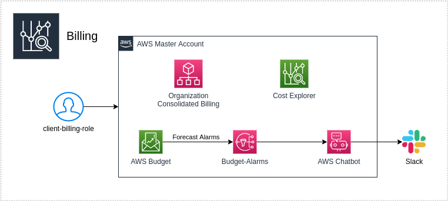

## FAQ

#### Frequently Asked Questions

- [Server Names and IP Addresses?](#how-server-names-and-ip-addresses-are-established%3F)
- [Firewall configurations?](#firewall-configurations%3F)
- [About Docker containers IP](#about-docker-containers-ip-(internet-protocol)-addresses)
- [Subnets across AZ](#subnets-across-availability-zones)
- [What are the benefits of running multiple containers?](#what-are-the-benefits-of-running-multiple-containers)
- [What is Elastic IP](#what-is-an-elastic-ip%3F)
- [Logging my ECS cluster](#logging-my-ecs-cluster)
- [How to set up a new GitLab pipeline?](#how-to-set-up-a-new-gitlab-pipeline%3F)
- [How to set up a new Bitbucket pipeline?](#how-to-set-up-a-new-bitbucket-pipeline%3F)
- [How to set up a new Github pipeline?](#how-to-set-up-a-github-pipeline%3F)
- [How to manage my credentials ](#how-to-manage-my-credentials%3F)
- [How to get billing insights?](#how-to-get-billing-insights%3F)
- [How to set up alarms?](#how-to-set-up-alarms%3F)
- [How to add a new user?](#how-to-add-a-new-user%3F)
- [Are operating system patches updated automatically?](#are-operating-system-patches-updated-automatically%3F)
- [Are physical access controls in place AWS datacenters?](#are-physical-access-controls-in-place-aws-datacenters%3F)

## How server names and IP Addresses are established?

There are no specific names for servers in your AWS cloud, as it runs on a Docker ECS (Elastic Container Service) Cluster structure. The servers are created and destroyed automatically according to the workloads and the Load Balancer.

The server names are usually: ecs-node-"application". Related with IP addresses, there are no Elastic IPs attached to it.

## Firewall configurations?

There are no firewalls to be configured. The traffic segregation and security are done through Security Groups and Network Access Control Lists (NACLs). Refer to AWS official documentation for NACLs (Network Access Control Lists) and Security Groups:

https://docs.aws.amazon.com/vpc/latest/userguide/vpc-network-acls.html
https://docs.aws.amazon.com/vpc/latest/userguide/VPC_SecurityGroups.html

## About Docker Containers IP (Internet Protocol) addresses

The default network is called bridge network, the Docker containers get an IP (Internet Protocol) from the host machine, which is internal to that machine.
New bridges are created for each docker compose.

## What are the benefits of running multiple containers

Running multiples containers you can have rapid resource scaling achieving high scalability in your AWS cloud, as each container takes seconds to provision.

## Subnets across Availability Zones

By default, subnets can talk between each other and each subnet lives in one AZ (Availability Zone).

## What is an Elastic IP?

An Elastic IP address is a static IPv4 address designed for dynamic cloud computing. An Elastic IP address is associated with your AWS account. With an Elastic IP address, you can mask the failure of an instance or software by rapidly remapping the address to another instance in your account. It is basically a public IPv4 address, which is reachable from the internet. It can be attached to your Elastic Load Balancer and publish to the internet.

More details here: https://docs.aws.amazon.com/AWSEC2/latest/UserGuide/elastic-ip-addresses-eip.html

## Logging my ECS cluster

The logs are centralized using CloudWatch, you can check metrics such as CPU Utilization, Memory Utilization and GPU Reservation. Check AWS documentation for more details: https://docs.aws.amazon.com/AmazonECS/latest/developerguide/cloudwatch-metrics.html

## How to set up a new GitLab pipeline?

GitLab uses .gitlab-ci.yml file to set your pipeline up, this file is located in the root folder of your repository. Pipelines can be complex structures, it consists of jobs and stages used to achieve continuous integration, delivery and deployment

More details: https://docs.gitlab.com/ee/ci/yaml/README.html#configuration-parameters

## How to set up a new Bitbucket pipeline?

Bitbucket uses "bitbucket-pipelines.yml" file to set your pipeline up, this file is located in the root folder of your repository. Pipelines can be complex structures, it consists of jobs and stages used to achieve continuous integration, delivery and deployment.

More details: https://support.atlassian.com/bitbucket-cloud/docs/configure-bitbucket-pipelinesyml

## How to set up a new github pipeline?

Github uses two .yml files. The files are github-ci-apply.yml and github-ci-plan.yml. Those files are used to set your pipeline up, this file is located in the folder .github/workflows of your repository. Pipelines can be complex structures, it consists of jobs and stages used to achieve continuous integration, delivery and deployment

More details: https://docs.github.com/en/free-pro-team@latest/actions

## How to manage my credentials?

You no longer have to manage credentials in your AWS accounts as we use SSO (Single Sign On) to authenticate in your cloud environment.

## How to get billing insights?

Use Trusted Advisor for billing insights, you have also security, performance, fault tolerance and service limits metrics.

Reference: https://aws.amazon.com/premiumsupport/technology/trusted-advisor/

## How to set up alarms?

Use Cloud Watch to set up your alarms, you have 3 alarms created by your Auto Scaling Group for each ECS (Elastic Container Service) Cluster and CloudFront, they are:

Alarm Low  - Memory Reservation
Alarm High - CPU Utilization
CloudFront - 500 errors

## How to add a new user?

Your AWS does not have IAM (Identity and Access Management) users created in your Production and Non-Production accounts, you can simply add and manage your users using your identity source.

More details: https://docs.aws.amazon.com/singlesignon/latest/userguide/what-is.html

## Are operating system patches updated automatically?

Your AWS platform uses Amazon Linux AMI (Amazon Machine Image) and updates are provided via a pre-configured yum repository hosted in each Amazon EC2 (Elastic Compute Cloud) region. You can find more details here: https://aws.amazon.com/amazon-linux-ami/faqs

## Are physical access controls in place AWS datacenters?

Yes, AWS has strict and secure protocols for controlling physical access to any datacenter. You can find more details consulting this AWS compliance section: https://aws.amazon.com/compliance/data-center/controls/
